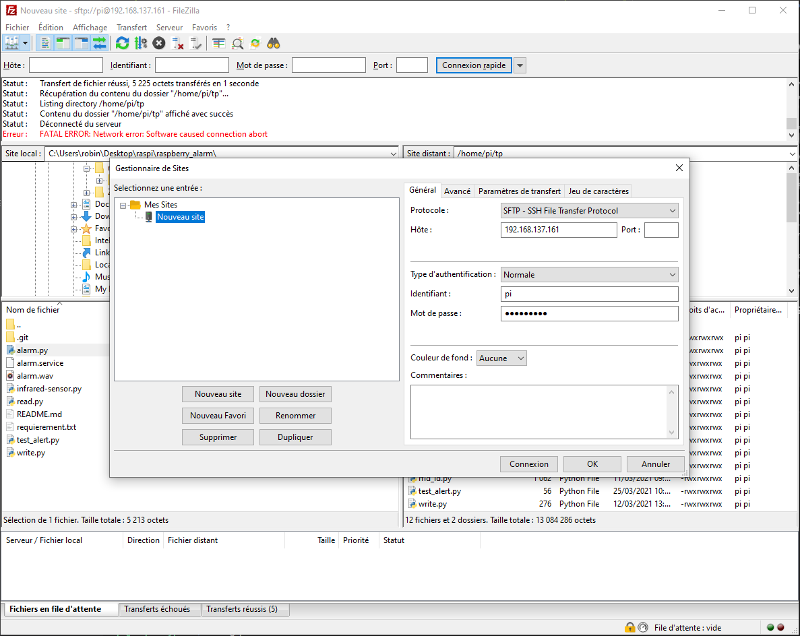

# TP Note IOT


## Team :
- Robin Bigeard
- Thomas Mary
- Maxime Grand
- Antoine Leblanc  

## Requierments :
- Git (clone project *optional)
- FileZila (optional)
- SSH (optional)
- SD Card
- Raspberry Pi
- Arduino UNO
- 1 LED / 1 Resistor
- Captor DHT11 (humidity, temperature)
- Cables

## Install Rapbian OS to SD card and configure Wifi
https://www.seeedstudio.com/blog/2021/01/25/three-methods-to-configure-raspberry-pi-wifi/

## Share you network (optional) :


```
ssh pi@192.168.137.161
// Authentificate 
// user : pi 
// password : raspberry
pi$ ~ mkdir tp
```

## Transfert script to Raspberry Pi with FileZilla or other


Transfert file in `tp` folder :
- main.py

## Install dependancy :
```
sudo apt-get update
sudo apt-get upgrade
sudo apt-get install python-serial
sudo pip install pyserial
cd tp
pip3 install google-cloud-firestore
```

## Configure Raspberry Pi :
```
# confi
sudo raspi-config

// Interface Options > I2C > Enable
// Interface Options > Serial Port > Enable
```

## Schema Connection 


## Schema Database 


## Aduino
Install Arduino : https://www.arduino.cc/en/software


Open file `TPNoteTemperature_Arduino.ino` 


Install `DHT` modules in library.  

And compile / transfert the code.

## Import credential authentication for Firebase
https://cloud.google.com/docs/authentication/getting-started
```
export GOOGLE_APPLICATION_CREDENTIALS=/home/pi/tp/BeAware-3d38a27421cd.json
```

## Execute script :
```
python3 main.py
```

